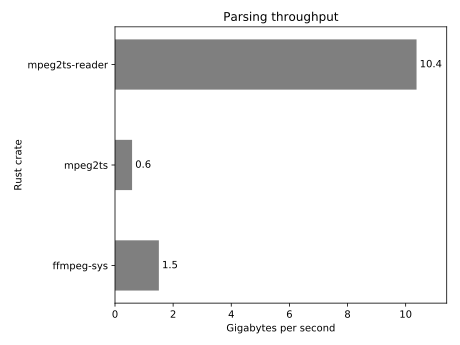

mpeg2ts-reader
==============

Rust reader for MPEG2 Transport Stream data

[](https://travis-ci.org/dholroyd/mpeg2ts-reader)
[](https://crates.io/crates/mpeg2ts-reader)
[](https://docs.rs/mpeg2ts-reader)
[](https://coveralls.io/github/dholroyd/mpeg2ts-reader)

Zero-copy access to payload data within an MPEG Transport Stream.

This crate,
 - implements a low-level state machine that recognises the structural elements of Transport Stream syntax
 - provides traits that you should implement to define your application-specific processing of the contained data.

# Example

Dump H264 payload data as hex.

```rust
#[macro_use]
extern crate mpeg2ts_reader;
extern crate hex_slice;

use std::env;
use std::fs::File;
use std::io::Read;
use mpeg2ts_reader::demultiplex;
use mpeg2ts_reader::pes;
use mpeg2ts_reader::StreamType;
use hex_slice::AsHex;
use std::cmp;

// This macro invocation creates an enum called DumpFilterSwitch, encapsulating all possible ways
// that this application may handle transport stream packets.  Each enum variant is just a wrapper
// around an implementation of the PacketFilter trait
packet_filter_switch!{
    DumpFilterSwitch<DumpDemuxContext> {
        // the DumpFilterSwitch::Pes variant will perform the logic actually specific to this
        // application,
        Pes: pes::PesPacketFilter<DumpDemuxContext,PtsDumpElementaryStreamConsumer>,

        // these definitions are boilerplate required by the framework,
        Pat: demultiplex::PatPacketFilter<DumpDemuxContext>,
        Pmt: demultiplex::PmtPacketFilter<DumpDemuxContext>,

        // this variant will be used when we want to ignore data in the transport stream that this
        // application does not care about
        Null: demultiplex::NullPacketFilter<DumpDemuxContext>,
    }
}

// This macro invocation creates a type called DumpDemuxContext, which is our application-specific
// implementation of the DemuxContext trait.
demux_context!(DumpDemuxContext, DumpStreamConstructor);

// When the de-multiplexing process needs to create a PacketFilter instance to handle a particular
// kind of data discovered within the Transport Stream being processed, it will send a
// FilterRequest to our application-specific implementation of the StreamConstructor trait
pub struct DumpStreamConstructor;
impl demultiplex::StreamConstructor for DumpStreamConstructor {
    type F = DumpFilterSwitch;

    fn construct(&mut self, req: demultiplex::FilterRequest) -> Self::F {
        match req {
            // The 'Program Association Table' is is always on PID 0.  We just use the standard
            // handling here, but an application could insert its own logic if required,
            demultiplex::FilterRequest::ByPid(0) =>
                DumpFilterSwitch::Pat(demultiplex::PatPacketFilter::new()),
            // Some Transport Streams will contain data on 'well known' PIDs, which are not
            // announced in PAT / PMT metadata.  This application does not process any of these
            // well known PIDs, so we register NullPacketFiltet such that they will be ignored
            demultiplex::FilterRequest::ByPid(_) =>
                DumpFilterSwitch::Null(demultiplex::NullPacketFilter::new()),
            // This match-arm installs our application-specific handling for each H264 stream
            // discovered within the transport stream,
            demultiplex::FilterRequest::ByStream(StreamType::H264, pmt_section, stream_info) =>
                PtsDumpElementaryStreamConsumer::construct(pmt_section, stream_info),
            // We need to have a match-arm to specify how to handle any other StreamType values
            // that might be present; we answer with NullPacketFilter so that anything other than
            // H264 (handled above) is ignored,
            demultiplex::FilterRequest::ByStream(_stype, _pmt_section, _stream_info) =>
                DumpFilterSwitch::Null(demultiplex::NullPacketFilter::new()),
            // The 'Program Map Table' defines the sub-streams for a particular program within the
            // Transport Stream (it is common for Transport Streams to contain only one program).
            // We just use the standard handling here, but an application could insert its own
            // logic if required,
            demultiplex::FilterRequest::Pmt{pid, program_number} =>
                DumpFilterSwitch::Pmt(demultiplex::PmtPacketFilter::new(pid, program_number)),
        }
    }
}

// Implement the ElementaryStreamConsumer to just dump and PTS/DTS timestamps to stdout
pub struct PtsDumpElementaryStreamConsumer {
    pid: u16,
    len: Option<usize>,
}
impl PtsDumpElementaryStreamConsumer {
    fn construct(_pmt_sect: &demultiplex::PmtSection, stream_info: &demultiplex::StreamInfo)
        -> DumpFilterSwitch
    {
        let filter = pes::PesPacketFilter::new(
            PtsDumpElementaryStreamConsumer {
                pid: stream_info.elementary_pid(),
                len: None
            }
        );
        DumpFilterSwitch::Pes(filter)
    }
}
impl pes::ElementaryStreamConsumer for PtsDumpElementaryStreamConsumer {
    fn start_stream(&mut self) { }
    fn begin_packet(&mut self, header: pes::PesHeader) {
        match header.contents() {
            pes::PesContents::Parsed(Some(parsed)) => {
                match parsed.pts_dts() {
                    pes::PtsDts::PtsOnly(Ok(pts)) => {
                        print!("PID {}: pts {:#08x}                ",
                               self.pid,
                               pts.value())
                    },
                    pes::PtsDts::Both{pts:Ok(pts), dts:Ok(dts)} => {
                        print!("PID {}: pts {:#08x} dts {:#08x} ",
                               self.pid,
                               pts.value(),
                               dts.value())
                    },
                    _ => (),
                }
                let payload = parsed.payload();
                self.len = Some(payload.len());
                println!("{:02x}", payload[..cmp::min(payload.len(),16)].plain_hex(false))
            },
            pes::PesContents::Parsed(None) => (),
            pes::PesContents::Payload(payload) => {
                self.len = Some(payload.len());
                println!("PID {}:                               {:02x}",
                         self.pid,
                         payload[..cmp::min(payload.len(),16)].plain_hex(false))
            },
        }
    }
    fn continue_packet(&mut self, data: &[u8]) {
        println!("PID {}:                     continues {:02x}",
                 self.pid,
                 data[..cmp::min(data.len(),16)].plain_hex(false));
        self.len = self.len.map(|l| l+data.len() );
    }
    fn end_packet(&mut self) {
        println!("PID {}: end of packet length={:?}",
                 self.pid,
                 self.len);
    }
    fn continuity_error(&mut self) { }
}

fn main() {
    // open input file named on command line,
    let name = env::args().nth(1).unwrap();
    let mut f = File::open(&name).expect(&format!("file not found: {}", &name));

    // create the context object that stores the state of the transport stream demultiplexing
    // process
    let mut ctx = DumpDemuxContext::new(DumpStreamConstructor);

    // create the demultiplexer, which will use the ctx to create a filter for pid 0 (PAT)
    let mut demux = demultiplex::Demultiplex::new(&mut ctx);

    // consume the input file,
    let mut buf = [0u8; 188*1024];
    loop {
        match f.read(&mut buf[..]).expect("read failed") {
            0 => break ,
            n => demux.push(&mut ctx, &buf[0..n]),
        }
    }
}
```

# Performance

On my laptop (which can read sequentially from main memory at around 16GiByte/s), a microbenchmark that parses TS
structure, but ignores the audio and video contained within, can process at a rate of **10 GiBytes/s** (80 Gibits/s).

Real usage that actually processes the contents of the stream will of course be slower!

The conditions of the test are,
 * the data is already in memory (no network/disk access)
 * test dataset is larger than CPU cache
 * processing is happening on a single core (no multiprocessing of the stream).

## Perf shoot-out

Comparing this crate to a couple of others which you might use to read a Transport Stream --
[mpeg2ts](https://crates.io/crates/mpeg2ts) and [ffmpg-sys](https://crates.io/crates/ffmpeg-sys):



The benchmarks producing the above chart data are in the [`shootout`](shootout) folder.  (If the benchmarks are giving
an unfair representation of relative performance, that's a mistake -- please raise a bug!)

# Supported Transport Stream features

Not all Transport Stream features are supported yet.  Here's a summary of what's available,
and what's yet to come:

- Framing
  - [x] _ISO/IEC 13818-1_ 188-byte packets
  - [ ] m2ts 192-byte packets (would be nice if an external crate could support, at least)
  - [ ] recovery after loss of synchronisation
- Transport Stream packet
  - [x] Fixed headers
  - [x] Adaptation field
- Program Specific Information tables
  - [x] Section syntax
  - [ ] 'Multi-section' tables
  - [x] PAT - Program Association Table
  - [x] PMT - Program Mapping Table
  - [ ] TSDT - Transport Stream Description Table
- Packetised Elementary Stream syntax
  - [x] PES_packet_data
  - [x] PTS/DTS
  - [x] ESCR
  - [x] ES_rate
  - [x] DSM_trick_mode
  - [x] additional_copy_info
  - [x] PES_CRC
  - [ ] PES_extension
- Descriptors
  - [ ] video_stream_descriptor
  - [ ] audio_stream_descriptor
  - [ ] hierarchy_descriptor
  - [x] registration_descriptor
  - [ ] data_stream_alignment_descriptor
  - [ ] target_background_grid_descriptor
  - [ ] video_window_descriptor
  - [ ] ca_descriptor
  - [x] iso_639_language_descriptor
  - [ ] system_clock_descriptor
  - [ ] multiplex_buffer_utilization_descriptor
  - [ ] copyright_descriptor
  - [ ] maximum_bitrate_descriptor
  - [ ] private_data_indicator_descriptor
  - [ ] smoothing_buffer_descriptor
  - [ ] std_descriptor
  - [ ] ibp_descriptor
  - [ ] mpeg4_video_descriptor
  - [ ] mpeg4_audio_descriptor
  - [ ] iod_descriptor
  - [ ] sl_descriptor
  - [ ] fmc_descriptor
  - [ ] external_es_id_descriptor
  - [ ] muxcode_descriptor
  - [ ] fmxbuffersize_descriptor
  - [ ] multiplexbuffer_descriptor
